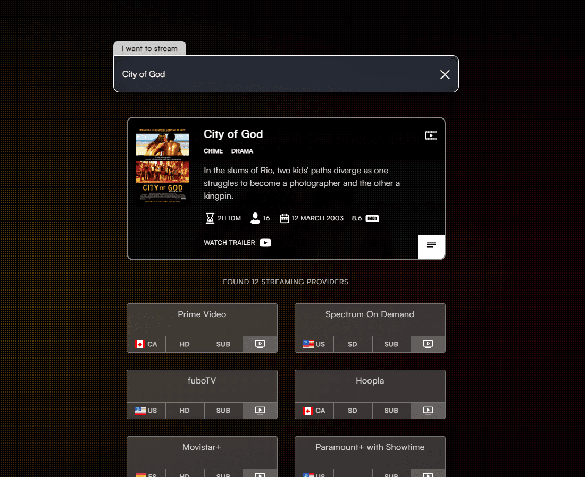

# Streaming Locator App

## Overview

This project is a streaming locator app that helps users find and discover streaming platforms for movies and TV shows. Users can search for titles, view details about streaming availability across different platforms, and get direct links to watch content.

[Find a stream](https://streaming-locator.vercel.app/)

## Features

- Search for movies and TV shows
- View streaming availability across multiple platforms (Netflix, Hulu, Amazon Prime, etc.)
- Get direct links to watch content on selected platforms
- Responsive design for mobile and desktop

##### Credits

- All icons taken from [SVGRepo](https://www.svgrepo.com/)
